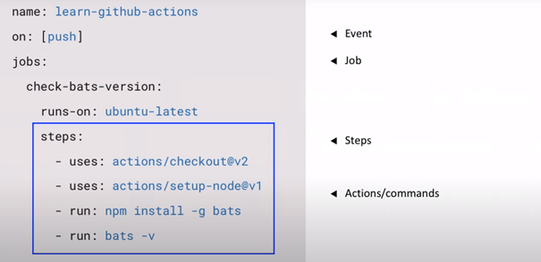
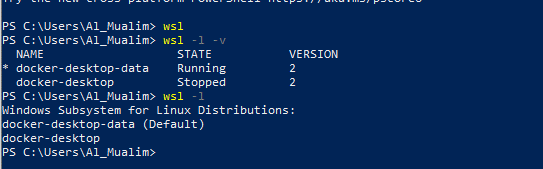

:imagedir: img

Documentatie voor overdracht product
Tijdregistratie, 200-280 uur

Tijdregistratie: Spreadsheet
Taken -> tickets in github
Halve dagen

Werkpakketje definieren va n 3 uren -> github, als het niet lukt bespreken

Buildserver+ versiebeheer systeem

= 19-3  9:00 – 10:00 Meeting hombergh +
:showtitle:

Activty diagram,(users en systemen) +
Componenten diagram
Benoem systemen in een deployment diagram (huidge systemen en processen) +
Ik word nummer 162 +
(( Begin aan documentatie, van maken en automatisch corrigeren van opgaven))
Huidige situatie ( eventueel nieuwe oplossing)

Tijdregistratie maken

= 26-3 9:30 – 10:00 Meeting
:showtitle:

Fontys
Diagram fatsoeneren
Trigger moet resulteren in de job

Bash script:
updatepeeryoungest.pl repositories "${REPOS}" "${REV}"
 
svnlook changed "$REPOS" -r "$REV" | tee "${REPOS}"/build-pending | \
curl -H "Content-Type: text/plain; charset=UTF-8" -X POST --data-binary @- https://builder1.fontysvenlo.org/aldarunner/run.php?path=${REPOS}\&rev=${REV}

/home/hom/teambin/builder-mkpending ${REPOS}
Nieuwe usecase: uit video halen

= 02-04 9:00 – 9:30 Meeting
:showtitle:

Maven compileer het spul, van compilatie moet rapport gemaakt worden en van testen moet een rapport gemaakt worden en code coverage rapport moet gemaakt worden +

TODO:
Usecases: student update, teacher grade, read test report toevoegen +
Documentatie, in ASCIdoctor +
Decanaat navraag, met Bruinsma tav van college geld eventueel samen met Fred +
Met Maven spelen, kijken hoe het builden het werkt +
Push assignments uit elkaar halen na commited van leraar +
Overgaan naar ASCIDOC in visual studio code

Fontys regelen voor peerweb
-	SonarQube (kijken naar mogelijkheid voor integratie aldarunner of opvolger van)

= 09-04 9:00 – 9:30 Meeting
:showtitle:

Github actions ff nakijken (onderzoekstraject) in de zin van bouwen van reportages van student projecten

*Resources* 

https://docs.github.com/en/actions 
https://youtu.be/cP0I9w2coGU +
*Summary* 

You can automate all the actions in a normal github work flow(main, branch) +

But also add custom actions in between those normal actions (Custom software development lifecycle workflows directly in your GitHub repository. +

Github actions are event driven, meaning that you can run a series of commands after a specified event has occurred(like a pull request).
 
Github actions use YAML syntax to define the events, jobs and steps(this is stored in your repository @ .github/workflows

 
 
In this case push is the event that triggered the action, and uses steps to control the order in which actions are run which automate your software testing.

These steps are: GitHub actions checks out the pushed code, install the software dependencies, runs bats-v to output the software version

Furthermore you can build test and publish across multiple Operating systems and languages in one workflow.

*Canvas API*(onderzoekstraject)

Resources
https://developer.mozilla.org/nl/docs/Web/API/Canvas_API

*WSDL* uitproberen(werkt volgens mij)
 
 

*Bash script* draaien in Visual Studio code(weet niet direct waar)

*ADOC* documenten opschonen(Gedaan)

*Notities in ADOC* netjes maken en uploaden(Gedaan)

= 16-04 9:00 – 9:30 Meeting

Notes fatsoeneren

Script schrijven voor committen

Maak een hello world(First contact week1) Kan ik een jacoco rapport draaien en publiceren => mogelijkheid( wordt gezipt en ergens neer gepleurd kan op canvas gegooid worden, en hypotese

Formatten in svg gebruiken

Activity diagram to be fabriceren
1.	Huidige stand v zaken
2.	Functioneel zelfde op GitHub?, wat is er nodig? Kom er achter door een poging te doen

Trek first contact door GitHub heen (reportage en interpretatie van reportage)

Kan ik een zipfile bouwen?

Maak documentatie klaar in github

= 30-04-2021: 0:00 – 1:00 Trello board opgezet en bijgewerkt